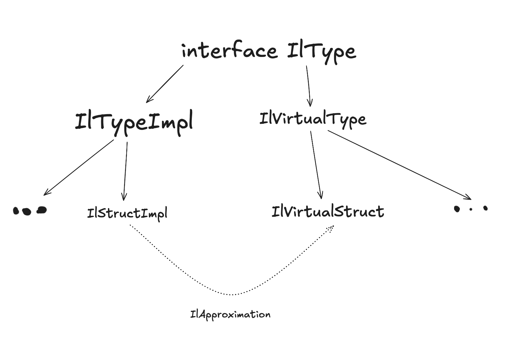

## Approximations

On generic parameter naming:

- no namespace name
- may be same for List<T> and Iterable<T> (tokens are different, constraints may be different)
    * hence T may have specific methods

```csharp
[Approximation("System.Collecitons.Generic.List[T]")]
class ListApproximation {
    // impl
}
```

Here we either use fully qualified name or reflection type (that will be further converted to a pair of asm and type
name)

Later, we may want to use the approximation for both `List<int>` and `List<string>` => we cannot rely on type fullname
to find its approximation type

```kotlin 
data class TypeId(val asmName: String, val typeName: String, val genericArgs: List<TypeId>)
// here typeName == namespace.enclosingType+type
// asmName is needed for situtations, where same typeNames found
```

`fun IlPublicationImpl.findIlTypeOrNull(val id: TypeId): IlType?` use TypeId properties in order typeName ->
genericArgs -> asmName (latter may not be present)

Then it is possible to find approximated type by name only and substitute generic args

# Approximations work on top of InctanceDto or Instance itself?

# Left `Type<T>` as a fullname and add filtering constraints into `findType`

# Stack overflow on typeId generation?

# Backing field for generic parameter with metadata token?

### Example

```csharp
[Approximation("Dictionary<K, V>")]
class DictionaryApproximation {
    // impl
}
[Approximaiton("List<T>")]
class ListApproximation {
    // impl
}

class UnderApprox {
    Dictionary<string, List<int>> Field;
    // impl
}

```
